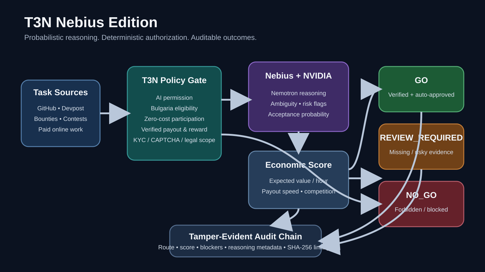

# T3N Trusted Approval Agent

[Live interactive demo](https://t3n-trusted-approval-agent.kostovdobromir.chatgpt.site)

A zero-cost, runnable MVP that puts a human approval boundary between an AI agent and sensitive real-world actions.

Built for the **AWS Agents for Humans Hackathon** Professional Agents track. The orchestration layer uses the official Strands Agents TypeScript SDK and exposes two narrow tools: task evaluation and guarded task start.

Tailored to **Task Hunter**: research and drafting can run autonomously, while applications, messages, account creation, and payments require explicit approval. Credential disclosure and CAPTCHA circumvention are denied.

## T3N Nebius Edition

The `nebius-hackathon` branch extends T3N for the **Nebius × NVIDIA Global AI Hackathon** with a hybrid architecture:

- **Nebius Token Factory + NVIDIA Nemotron** provides structured reasoning about scope, ambiguity, risk, acceptance probability, and estimated effort.
- **Deterministic policy gates** independently verify AI permission, Bulgaria eligibility, zero-cost participation, payout verification, reward confirmation, KYC/CAPTCHA constraints, and legal clarity.
- **Economic scoring** ranks opportunities using expected value per hour, payout speed, and competition.
- **Tamper-evident audit logging** records the final route and the evidence-derived decision path.

The model never gets authority to override policy. Missing or conflicting evidence fails closed.



### Decision flow

```text
Opportunity
   │
   ├──> T3N deterministic policy gate ── blocked ──> REVIEW_REQUIRED / NO_GO
   │
   └──> Nebius-hosted Nemotron reasoning
              │
              └──> Economic score
                       │
                       └──> GO / REVIEW_REQUIRED / NO_GO
                                  │
                                  └──> Hash-chained audit event
```

### Run the Nebius demo

The default demo uses mocked model output and requires no paid API:

```bash
npm install
npm test
npm run demo:nebius
```

For live inference with hackathon credits:

```bash
export NEBIUS_API_KEY='<your-local-key>'
export RUN_NEBIUS_MODEL=1
npm run demo:nebius
```

Optional overrides:

```bash
export NEBIUS_BASE_URL='https://api.tokenfactory.us-central1.nebius.com/v1'
export NEBIUS_MODEL='nvidia/nemotron-3-super-120b-a12b'
```

Never commit API keys.

### What judges can verify quickly

1. Run `npm test` and confirm policy, scoring, orchestration, and audit tests pass.
2. Run `npm run demo:nebius`.
3. Observe a verified AI-allowed, zero-cost, SEPA-paid opportunity route to `GO`.
4. Observe an unsafe/unverified opportunity route to `REVIEW_REQUIRED`.
5. Confirm the audit chain verifies after both decisions.

This design intentionally separates **probabilistic reasoning** from **deterministic authorization**.

## How it works

1. An agent requests an action with its `did:t3n` identity.
2. Policy returns `allow`, `approval_required`, or `deny`.
3. A human approves the exact payload; any change invalidates approval.
4. The gateway consumes the approval once and returns a receipt.
5. Every step is written to a tamper-evident audit chain.

## Run locally

Requires Node.js 22.18+ (Node 24 recommended).

```bash
cp .env.example .env
npm test
npm run demo
npm run demo:strands
npm start
```

Open `http://localhost:3000`. Local mode uses a labelled mock identity and simulated external actions, so it cannot accidentally submit or pay anything.

`npm run demo:strands` proves the end-to-end workflow without cloud spend: a fully verified SEPA task reaches `CLAIMED`, while an unverified crypto/KYC task stops at `REVIEW_REQUIRED`. To exercise the conversational Strands model loop, configure an authorized model provider and set `RUN_STRANDS_MODEL=1`.

## Strands workflow

1. `evaluate_paid_task` validates official reward evidence, Bulgaria eligibility, AI permission, zero upfront cost, payout route, KYC/CAPTCHA and legal clarity.
2. `start_eligible_task` receives the same typed evidence and cannot bypass validation.
3. Only a complete match receives the narrow `task.claim.standing-approval` policy decision.
4. The gateway emits a one-time simulated receipt and a tamper-evident audit event.
5. Missing or risky evidence fails closed as `REVIEW_REQUIRED`.

## Real T3N sandbox identity

Terminal 3 provides free sandbox credits. The optional adapter follows the official order: verified trust manifest, WASM crypto, encrypted handshake, then DID authentication.

```bash
npm install
export T3N_MODE=t3n
export T3N_API_KEY='<agent-key>'
npm start
```

Never commit keys. A tenant and its agent need separate keys and balances.

## Security properties

- Fail-closed unknown actions
- HMAC-SHA256 approvals bound to a canonical action digest
- Constant-time signature comparison
- Five-minute, single-use approvals
- EUR 50 payment cap
- Append-only SHA-256 audit hash chain
- No secrets exposed to the dashboard or audit detail
- Mock execution by default

## Current scope

The MVP proves the approval and audit boundary. Production should replace the demo signer with an organization-owned verifier, persist pending actions transactionally, register the agent/contract in T3N, and execute destination calls inside an authorized TEE contract.

## Official references

- [Terminal 3 Agent Developer Kit](https://terminal3.io/products/agent-developer-kit)
- [T3N ADK docs](https://docs.terminal3.io/developers/adk/overview/what-is-adk)
- [SDK reference](https://docs.terminal3.io/developers/adk/reference)
- [Member delegation](https://docs.terminal3.io/developers/adk/get-started/member-delegation)

## License

MIT
