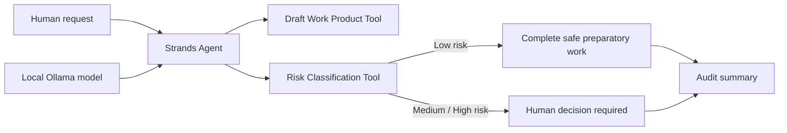

# TaskPilot Architecture

TaskPilot deliberately separates model reasoning from consequence control. The Strands Agent can autonomously prepare work, organize information, and draft outputs. Before any meaningful external or state-changing action, the deterministic policy tool classifies the action and requires human approval when necessary.

The default model provider is local Ollama, so the reference implementation can run without paid AWS runtime usage. AgentCore is intentionally not claimed in this version.
